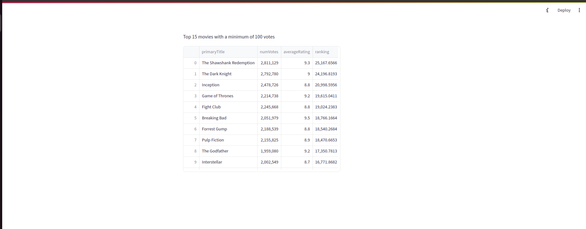

# IMDb Data Analysis App

This Python Streamlit web app uses DuckDB to fetch the top 15 movies with a minimum of 100 votes from the IMDb datasets.

## Prerequisites

- Python 3.10
- Streamlit
- DuckDB

You can install the necessary libraries using pip:

```bash
pip install -r requirements.txt
```

## Data Source

The app uses the following IMDb datasets:

- `title.ratings.tsv.gz`: [https://datasets.imdbws.com/title.ratings.tsv.gz](https://datasets.imdbws.com/title.ratings.tsv.gz)
- `title.basics.tsv.gz`: [https://datasets.imdbws.com/title.basics.tsv.gz](https://datasets.imdbws.com/title.basics.tsv.gz)

## Running the App from local machine

**NB! run from repo root directory.**
You can run your Streamlit app using

```bash
streamlit run imdb_data_analysis/app/main.py
```

## Running the App from Docker

**NB! run from repo root directory.**

1. Build the docker image
   ```bash
   cd imdb_data_analysis
   docker build -t dmn_eng_imdb_analysis:INSERT_TAG_HERE .
   ```
   (if your PC's anything like mine, you'll need to run this with `sudo`)
    ```bash
    cd imdb_data_analysis/
    sudo docker build -t dmn_eng_imdb_analysis:INSERT_TAG_HERE .
    ```  

2. Run the docker image
   ```bash
    docker run -p 4000:80 dmn_eng_imdb_analysis:INSERT_TAG_HERE
    ```
   (if your PC's anything like mine, you'll need to run this with `sudo`)
   ```bash
    sudo docker run -p 4000:80 dmn_eng_imdb_analysis:INSERT_TAG_HERE
    ```

## App Functionality

The app fetches data from the IMDb datasets and calculates a ranking score for each movie using the
formula `(numVotes / averageNumberOfVotes) * averageRating`. It then displays the top 15 movies based on this ranking
score.

## Run Tests

1. Download IMDb sample dataset. **NB! run from repo root directory.**

    ```bash
    python3 tests/test_resources/download_test_samples.py
    ```
    ```bash
    ./download_test_samples.sh
   ```
2. Run automated testing command

    ```bash
    python3 -m unittest discover -s tests
    ```

## App Preview


## Notes for Reviewer

* Due to time constraints I made a call to have 4 possible success case tests. In a real world scenario I would have
  more tests to cover possible failure cases for better coverager. It would be greate to know what you think of that.
* I used duckdb for the first time. I found it to be a very interesting project and I would like to explore it more in
  the future.
* I used streamlit for the first time. I found it to be a very interesting project and I would like to explore it more
  in the future.
* Please let me what aspects of this submission I can improve on.

## License

This project is licensed under the MIT License - see the [LICENSE](LICENSE) file for details.
